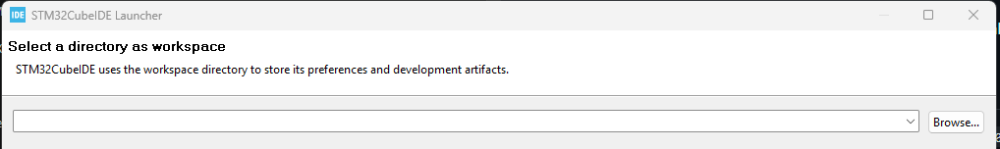
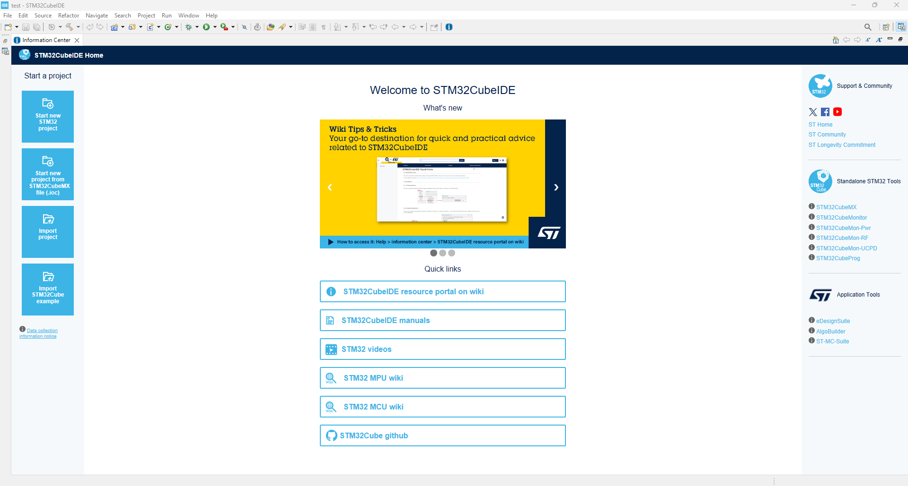
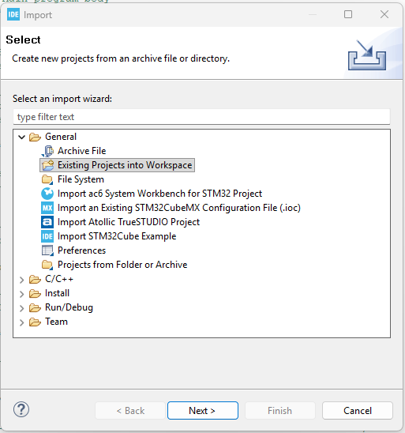
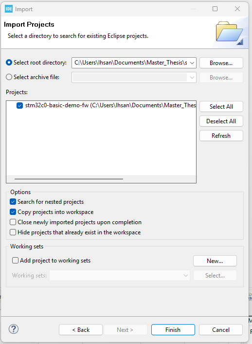
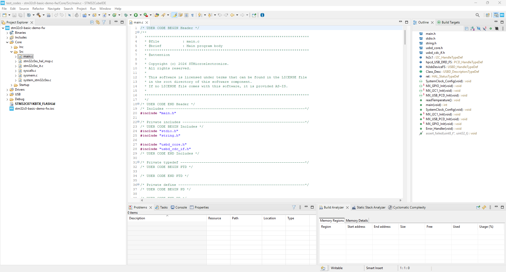
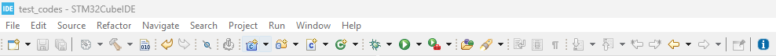
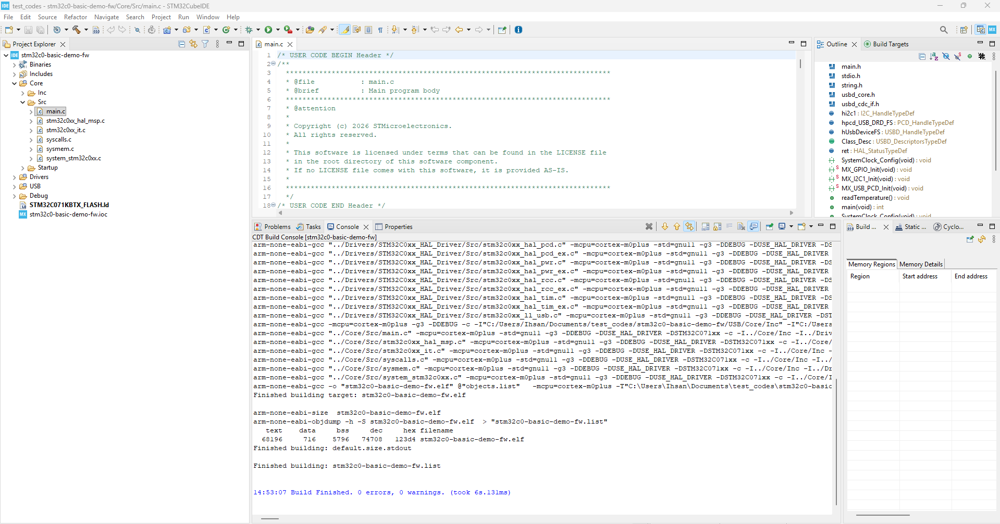
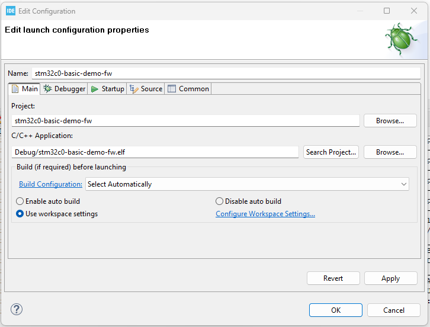
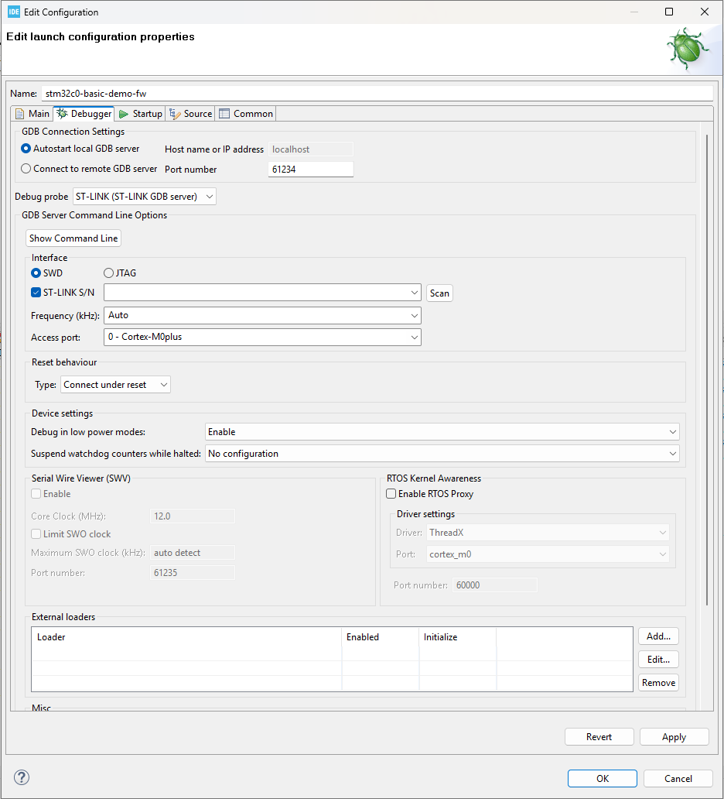

# Importing Existing Code — STM32CubeIDE 1.17.0

## Requirements

### Hardware
- Functional board
- STLINK-V3MINIE programmer and Programmer Bridge
- Type-C cable

### Software
- [STM32CubeIDE 1.17.0](https://www.st.com/en/development-tools/stm32cubeide.html)
- [STM32CubeMX](https://www.st.com/en/development-tools/stm32cubemx.html)
- [STM32CubeProgrammer](https://www.st.com/en/development-tools/stm32cubeprog.html)

## Software Basics

- **STM32CubeIDE 1.17.0**: An integrated development environment (IDE) used to write, compile, debug, and run code on STM32 microcontrollers.
- **STM32CubeMX**: A graphical configuration tool for setting up pins, peripherals, and middleware, and generating initialization code for use in STM32CubeIDE.

These two tools complement each other. STM32CubeMX is typically opened within STM32CubeIDE to configure the target and generate the `.ioc` file.

# Getting Started

Download and install all three required software packages, then open **STM32CubeIDE 1.17.0**.

> [!WARNING]
> Existing STM32 code in this project was written using STM32CubeIDE version 1.17.0. Newer versions can be used, but the code may need to be migrated.

# Importing a Sample Programme

1. Launch STM32CubeIDE 1.17.0 and choose a folder as your workspace directory.  
   

2. After selecting the preferred folder, the STM32CubeIDE user interface will load.  
   

3. From the start screen, select **Import project**.  
   

4. Navigate to the functional board demo code and select the options shown below.  
   

5. Click **Finish**.

6. The project will open as **stm32c0-basic-demo-fw** in STM32CubeIDE. Navigate to the **Src** folder and open `main.c` to activate the build option.  
   

7. Once `main.c` is opened, the build option becomes active. It is shown as a small hammer icon.  
   

8. Click the build option to compile the code.  
   

9. Select the project and click **Debug** to open the debug configuration window. In the **Main** tab, the build configuration name is automatically set to the project name.  
   

10. Open the **Debugger** tab, select the **SWD** interface, tick **ST-LINK S/N**, click **Scan** for the Nucleo board, then click **Apply** and **OK**.  
    

11. The IDE will now generate and build the code before flashing it to the board. Once flashing is complete, the **Debug perspective** will open.

12. Navigate in the Debug window and step from `HAL_Init();` using the debug controls at the top of the window.

13. Stop the debugging session by clicking **Stop**. The board will then run normally.

> Note: Sometimes the USB code may fail to initialize during a debug session because step-by-step debugging is enabled. No fix has been added in the demo code.
